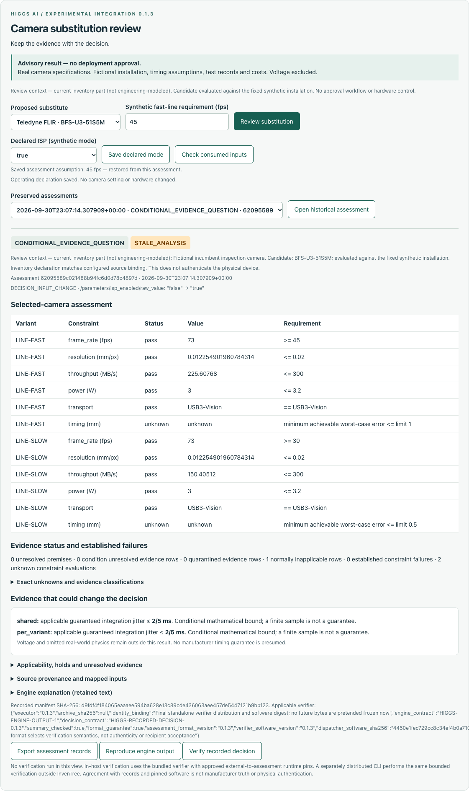

# Higgs InvenTree Camera Change Review

## When the inputs change, know which decisions need revisiting.

**Created and led by Kamden Higgs. Higgs AI.** Experimental integration `0.1.3+correction.1` for InvenTree 1.5.6.

Review a proposed camera against an explicit synthetic installation, preserve the decision and its inputs, flag a saved assessment when relevant inventory declarations change, and export a record that can be rechecked outside InvenTree.

**Start with the [three-screen demonstration](docs/DEMONSTRATION.md)** — no installation needed. Or open `docs/demo.html` locally for the same walkthrough. These are saved outputs, not a hosted service.

| Demonstrated step | What happened |
|---|---|
| Assess with ISP declared off | Conditional: an applicable guaranteed jitter ≤ 0.4 ms could resolve the remaining modeled timing uncertainty. |
| Change the declared ISP setting | The prior assessment is flagged stale and retained unchanged. No hardware is controlled. |
| Assess with ISP declared on | Established frame-rate blocker: 24 fps against synthetic 45/30 fps requirements. Jitter evidence alone cannot fix it. |
| Recheck the blocked export separately | The matching verifier reproduces the decision and accepts the record under the explicitly chosen assurance requirement. The camera recommendation remains blocked. |

### Try the smallest reproducible part

Follow [offline verification](docs/OFFLINE_VERIFICATION.md) to recheck the saved blocked assessment using Python 3.12. No InvenTree installation, AI model, API key or network is needed for that operation. The original separate-process execution is preserved; this packaging task did not repeat it.

For the interactive workflow, see [isolated installation and manual inventory setup](docs/INSTALLATION.md). The unchanged tested wheel is in `dist/`; the matching standalone verifier is in `verifier/` and as an unchanged ZIP in `downloads/`. InvenTree and its dependencies must be supplied separately. This package is not a ready-to-run host or a production deployment.

### What the user supplies

Explicit camera/manufacturer and parameter bindings, a declared operating mode, and the fast-line requirement. The remaining installation model is fixed and synthetic. There is no automatic document interpretation, source authentication, device discovery or hardware control. The current inventory part is review context, not a modeled incumbent.

### Evidence and limitations

The corrected build has author testing, a separate nonblind review, and a recorded fresh-install browser demonstration. [Review status](docs/REVIEW_STATUS.md) distinguishes those executions and their limitations. Test counts overlap. Known limits include a `1e999` stored-summary opening error and exact-build verification requirements; see [known limitations](docs/KNOWN_LIMITATIONS.md).

No hardware qualification, general compatibility, manufacturer endorsement, deployment approval, customer validation, measured savings or CogniMap superiority is claimed. **Verification acceptance concerns the record; it does not approve an installation.**

### Versions and licensing

This integration uses the near-real wrapper 0.1.2 and retained camera runtime 0.3.0-rc.1. These are separate version lineages. The distribution is `0.1.3+correction.1`; the UI/protocol says `0.1.3` and the inherited module label says `0.1.2`. The unchanged source identity is `4450e1fec729cc8c34ef4b0a71005eb35d267c5a4f2bf4aa40f5aa21ea3c5e9b`.

MIT for material Kamden controls: [license](LICENSE), [current decision](LICENSE_STATUS.md), [attribution](ATTRIBUTION.md). Historical metadata is preserved. [Public file list](PUBLIC_FILES.json) and [manifest](MANIFEST.json) describe this composition. This local package awaits publication approval; no hosted demonstration is claimed.

The [standalone camera project](https://github.com/KamHiggs/higgs-camera-change-review) retains its own published versions; this integration does not replace their source or release history.
