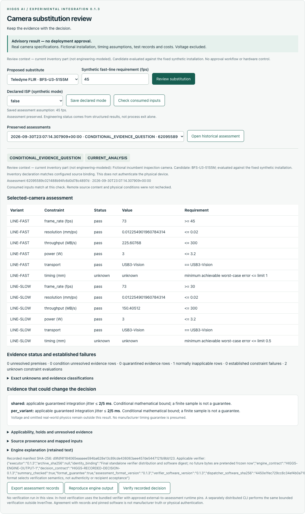
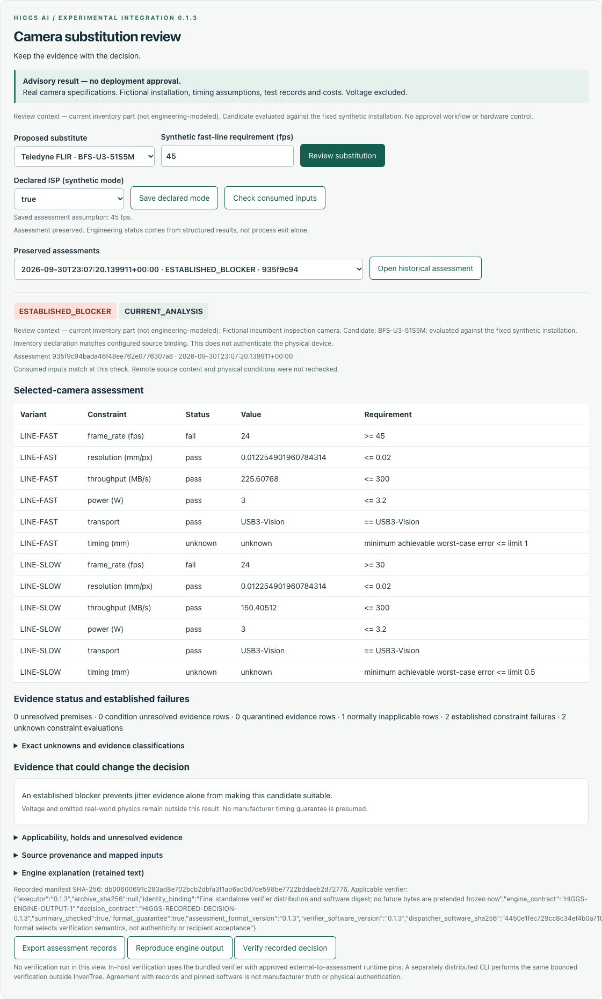

# A changed input. A stale assessment. A re-checkable decision.

**Higgs AI · Created and led by Kamden Higgs.** Recorded September 30, 2026, using the exact `0.1.3+correction.1` wheel and matching verifier.

These three unmodified screenshots come from a scripted headless browser driving the real local InvenTree panel. They are selected views from a seven-capture sequence, not reconstructed interfaces. The copied synthetic database initially declared ISP on; setup changed it to off through the panel. A local superuser performed this demonstration. All services were subsequently reported stopped.

## 1. Make the missing evidence specific

With ISP declared off, the modeled camera frame rate is 73 fps against 45/30 fps requirements. Timing remains unknown. The panel calculates the missing condition:

> applicable guaranteed integration jitter ≤ 2/5 ms.

*Exact excerpt from the panel in screenshot 04. The bound is 0.4 ms under the synthetic model; a sample is not a guarantee.*



The saved assessment is `62095589c021488b94fc6d0d78c4897d`. Its [unchanged export](../examples/exports/first-assessment-isp-off.zip) is included. It was not separately verified during this demonstration.

## 2. Keep history, but flag what changed

Change the declared ISP setting to on. This is a software declaration, not an action on a camera. Reopening the earlier assessment preserves its ID, manifest and original 73-fps results while displaying `STALE_ANALYSIS` and the changed field.


The assessment manifest remains `d9fdf4f184065eaaaee594ba628e13c89cde436063aee457de5447121b9bb123`.

## 3. Show why the new decision is different

The new assessment reports 24 fps against 45 and 30 fps requirements. Throughput still passes, timing remains unknown, and an established frame-rate failure takes precedence:

> An established blocker prevents jitter evidence alone from making this candidate suitable.

*Exact panel excerpt from screenshot 07.*



The new assessment is `935f9c94bada46f48ee762e0776307a8`. Its [unchanged export](../examples/exports/second-assessment-isp-on.zip) carries the recorded inputs and result.

## 4. Verify the record outside InvenTree

A separate Python process ran the matching verifier against the blocked export with requirement `HIGGS-RECORDED-DECISION-0.1.3`. The preserved machine-written receipt contains these exact field values:

```json
"historical_verification": {"status": "VERIFIED_RECORDED_DECISION"}
"acceptance": {"status": "ACCEPTED", "code": "REQUIRED_ASSURANCE_MET"}
```

*Selected JSON field excerpts, not a complete JSON document.* Exit code was 0, stderr was empty, and saved comparison records report byte-identical engine outputs. Read the [complete saved receipt](../evidence/recorded-verification/VERIFICATION_RESULT.json) and [comparison](../evidence/recorded-verification/ENGINE_COMPARISON.json). These are historical demonstration outputs, not a new verification performed for the reader.

**The record verifies. The engineering recommendation remains blocked.** Acceptance does not authenticate manufacturer facts, approve hardware installation or establish general engineering correctness.

Follow [the offline instructions](OFFLINE_VERIFICATION.md) to perform your own check. The conditional export, in-host verification buttons, other cameras and evidence expanders were not exercised by this demonstration. [Evidence projection](../evidence/DEMONSTRATION_RECORD.json) · [Review status](REVIEW_STATUS.md) · [Limits](KNOWN_LIMITATIONS.md).

## Questions for a prospective user

1. How do you currently document and review a component substitution?
2. Where would a stale-assessment warning or portable recheck reduce work or uncertainty in a recent example?
3. What preparation or integration burden would prevent you from using this workflow?
